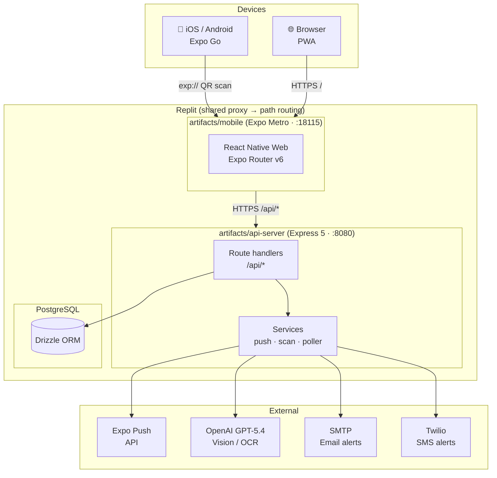
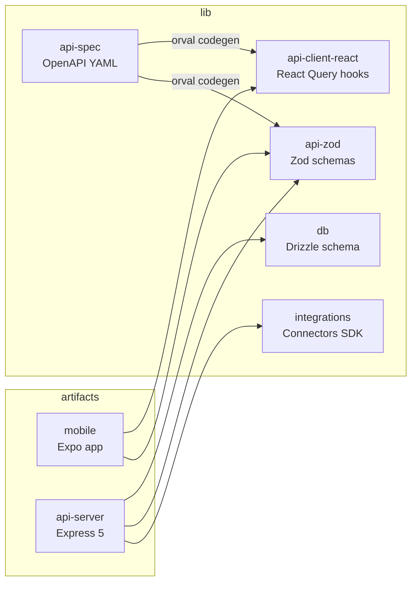
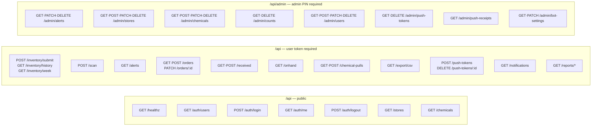
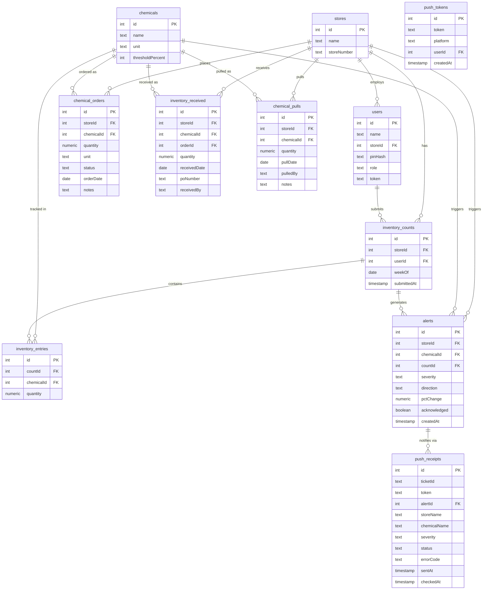
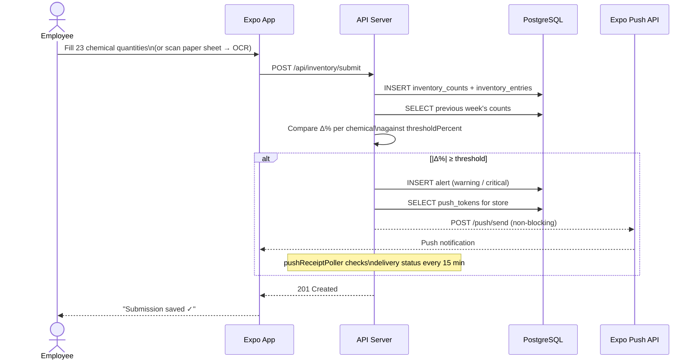
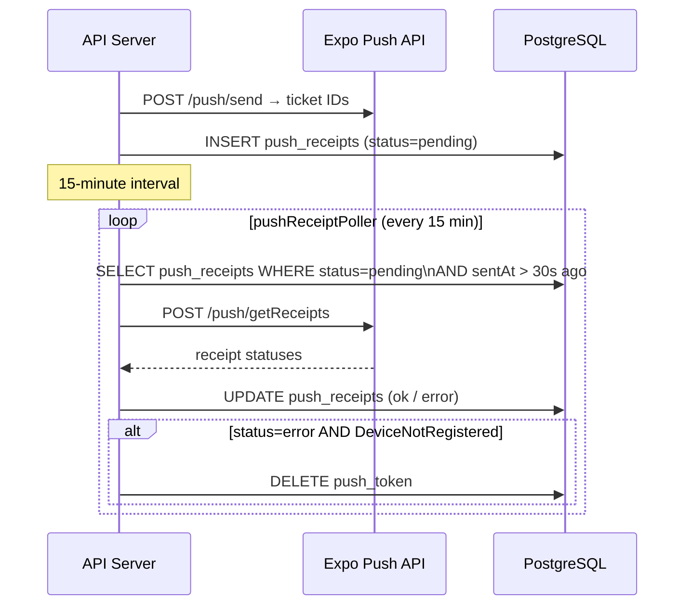
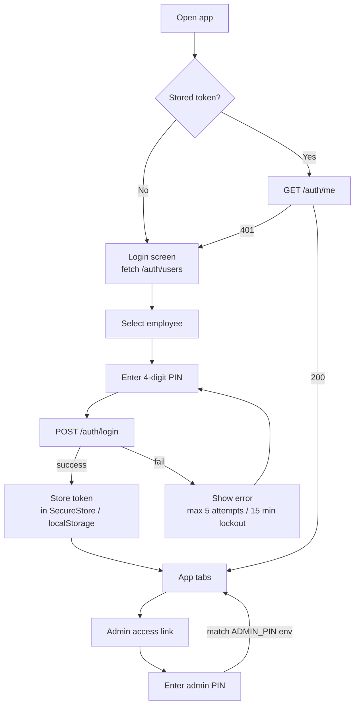

# Architecture

Red Carpet Inventory is a **pnpm monorepo** running a React Native (Expo) mobile app backed by an Express 5 API server and a PostgreSQL database. This document covers the system topology, data model, request flow, and package dependency graph.

---

## System Overview

---

## Monorepo Package Graph

---

## API Route Map

---

## Database Schema (ER Diagram)

---

## Weekly Count Submission Flow

---

## Push Notification Delivery Pipeline

---

## Authentication Flow

